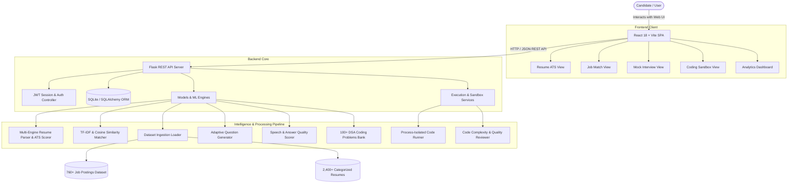

# PrepWise AI: Unified Career Intelligence & Interview Preparation Platform

[](https://www.python.org/)
[](https://flask.palletsprojects.com/)
[](https://reactjs.org/)
[](https://www.sqlite.org/)
[]()

> **Major Project Developed by:** Ganesh Pawar  
> **Domain:** Full-Stack Web Development, Applied Natural Language Processing (NLP), and Machine Learning

---

## Executive Summary

Traditional job-seeking and career preparation tools are fragmented. Candidates often rely on one tool for resume formatting, another for practice questions, and isolated platforms for job hunting—leading to disjointed feedback and zero progress tracking. 

**PrepWise AI** solves this by providing a single, unified career intelligence ecosystem. It integrates:
1. **Automated Resume Parsing & ATS Compatibility Scoring**
2. **Semantic Job Recommendation & Skill Gap Analysis**
3. **Adaptive AI Mock Interviewing with Real-Time Speech & Vocal Evaluation**
4. **Sandboxed Multi-Language Coding Assessment Engine & Code Review**
5. **Consolidated Candidate Performance Analytics Dashboard**

---

## System Architecture



---

## Key Modules & Features

### 1. Resume Analysis & ATS Optimization
- Accepts candidate resumes in PDF, DOCX, or raw plain text.
- Extracts candidate name, contact information, education, experience, and skills against a curated taxonomy of 200+ technical and soft skills.
- Computes ATS (Applicant Tracking System) compatibility scores (0–100%) by evaluating keyword density, formatting structure, section completeness, and readability.
- Highlights missing high-impact sections and recommends concrete bullet-point improvements.

### 2. Intelligent Job Recommendation & Skill Gap Analysis
- Uses TF-IDF vectorization and Cosine Similarity to compare candidate profile vectors against a dataset of 760 real-world job postings.
- Calculates an empirical **Company Acceptance Probability** for each posting.
- Detects missing prerequisite skills for target roles and generates a personalized upskilling roadmap.

### 3. Adaptive AI Mock Interview & Vocal Evaluator
- Dynamically generates domain-specific behavioral and technical questions based on candidate resume category and selected difficulty.
- Supports both text input and hands-free voice responses via the browser Web Speech API.
- Multi-dimensional answer evaluation:
  - **Keyword & Technical Coverage:** Semantic alignment with ideal model answers.
  - **Coherence Index:** Flow, structural clarity, and relevance.
  - **Speech Cadence & Fluency:** Words per minute, filler-word frequency, and vocal confidence.
- Dynamically scales question difficulty up or down based on performance across consecutive questions.

### 4. Multi-Language Sandboxed Coding Assessment
- In-browser code editor supporting **Python**, **JavaScript (Node.js)**, **Java**, and **C++**.
- 100+ production-grade Data Structures and Algorithms (DSA) questions spanning 15 topics (Arrays, Strings, Dynamic Programming, Trees, Graphs, etc.).
- Submissions run inside a process-isolated sandbox with memory limits, strict execution timeouts, and test-case validation.
- Evaluates asymptotic Big-O time and space complexity and provides progressive 3-tier hints.

### 5. Consolidated Candidate Analytics Dashboard
- Aggregates resume health, interview readiness tiers (Low / Medium / High), and coding challenge pass rates.
- Interactive Chart.js visualizations displaying historical score trajectories over time.
- Single-click export of candidate evaluation summaries.

---

## Repository Structure

```
majorproject/
├── backend/                       # Flask REST API Backend
│   ├── models/                    # ML / NLP models & question banks
│   │   ├── coding_problems.py     # Coding problems metadata
│   │   ├── coding_questions_bank.py # 100+ multi-language DSA questions
│   │   ├── dataset_loader.py      # Dataset loader with path fallbacks
│   │   ├── deep_answer_evaluator.py # Answer quality & semantics evaluator
│   │   ├── external_parsers.py    # Third-party parser integration hooks
│   │   ├── interview_evaluator.py # Interview orchestrator & question bank
│   │   ├── job_matcher.py         # TF-IDF & Cosine Similarity job matcher
│   │   ├── resume_parser.py       # Multi-engine resume parser & ATS engine
│   │   ├── sentence_bert_ats.py   # Semantic similarity embeddings helper
│   │   └── vocal_analyzer.py      # Speech cadence & fluency analyzer
│   ├── services/                  # Execution engines & services
│   │   ├── ai_coding_evaluator.py # 8-dimension code review engine
│   │   ├── code_executor.py       # Code execution runner
│   │   └── secure_code_sandbox.py # Sandboxed process isolation environment
│   ├── app.py                     # Flask application factory & routes setup
│   ├── config.py                  # Centralized configuration & environment loader
│   ├── database.py                # SQLAlchemy ORM models & SQLite connection
│   ├── prepwise.db                # SQLite database
│   ├── routes_auth.py             # User authentication & session endpoints
│   ├── routes_coding.py           # Coding assessment & execution endpoints
│   ├── routes_dashboard.py        # Performance metrics & analytics endpoints
│   ├── routes_interview.py        # Mock interview session endpoints
│   ├── routes_jobs.py             # Job recommendation endpoints
│   └── routes_resume.py           # Resume upload & ATS analysis endpoints
│
├── frontend/                      # React 18 + Vite Frontend Application
│   ├── src/
│   │   ├── components/
│   │   │   └── CodeEditor.jsx     # Multi-language code editor & test runner
│   │   ├── pages/
│   │   │   ├── AuthView.jsx       # Login, Register & Session verification
│   │   │   ├── DashboardView.jsx  # Candidate analytics & charts
│   │   │   ├── InterviewView.jsx  # AI Mock Interview with Speech-to-Text
│   │   │   ├── JobMatchView.jsx   # Job recommendations & skill gap matching
│   │   │   ├── ProfileView.jsx    # Candidate profile management
│   │   │   └── ResumeView.jsx     # Resume uploader & ATS feedback report
│   │   ├── App.jsx                # Main application component & navigation
│   │   ├── index.css              # Custom design system & glassmorphism theme
│   │   └── main.jsx               # React entry point
│   ├── index.html                 # HTML shell
│   ├── package.json               # Node.js dependencies & scripts
│   └── vite.config.js             # Vite bundler configuration
│
├── data/                          # Organized Dataset Files
│   ├── jobs/
│   │   ├── jobs_dataset.csv       # 760 real-world job postings
│   │   └── jobs_dataset.json      # Structured job metadata
│   └── resumes/
│       ├── Resume.csv             # 2,480+ categorized resumes
│       └── samples/               # Categorized sample PDF resume documents
│
├── docs/                          # Project Documentation & Academic Reports
│   └── PrepWise_AI_Project_Report.pdf # Comprehensive Project Report
│
├── .env.example                   # Environment configuration template
├── .gitignore                     # Git ignore rules for Python, Node, and IDEs
├── requirements.txt               # Backend Python dependencies
├── run.py                         # Root entry point launcher
└── README.md                      # Project documentation
```

---

## Getting Started

### Prerequisites
- **Python 3.10+**
- **Node.js 18+ & npm**
- **Git**

---

### Step 1: Clone the Repository
```bash
git clone https://github.com/ganeshpawar2286/majorproject.git
cd majorproject
```

---

### Step 2: Backend Setup
1. Create and activate a Python virtual environment:
   ```bash
   # Windows (PowerShell)
   python -m venv venv
   .\venv\Scripts\Activate.ps1

   # macOS / Linux
   python3 -m venv venv
   source venv/bin/activate
   ```

2. Install backend dependencies:
   ```bash
   pip install -r requirements.txt
   ```

3. (Optional) Set up environment variables:
   ```bash
   # Copy template to active .env
   cp .env.example .env
   ```

4. Start the backend server:
   ```bash
   python run.py
   ```
   *The Flask REST API will start on `http://localhost:5000`.*  
   *Verify with: `http://localhost:5000/api/health`*

---

### Step 3: Frontend Setup
1. Open a new terminal and navigate to the `frontend/` directory:
   ```bash
   cd frontend
   ```

2. Install frontend dependencies:
   ```bash
   npm install
   ```

3. Start the Vite development server:
   ```bash
   npm run dev
   ```
   *The application will launch on `http://localhost:5173`.*

---

## API Endpoints Overview

| Method | Endpoint | Description |
| :--- | :--- | :--- |
| `GET` | `/api/health` | Service health and environment status |
| `POST` | `/api/auth/register` | Register a new candidate account |
| `POST` | `/api/auth/login` | Authenticate user & issue session token |
| `POST` | `/api/auth/verify-session` | Validate active session token |
| `POST` | `/api/resume/parse` | Parse PDF/DOCX resume & calculate ATS score |
| `POST` | `/api/jobs/recommendations` | Get ranked jobs matched to candidate profile |
| `POST` | `/api/interview/start-session`| Initialize an adaptive mock interview session |
| `POST` | `/api/interview/evaluate-answer` | Evaluate candidate verbal or text answer |
| `GET` | `/api/coding/questions` | List curated DSA coding questions |
| `POST` | `/api/coding/run` | Execute code against public test cases |
| `POST` | `/api/coding/submit` | Submit code for sandboxed testing & evaluation |
| `POST` | `/api/coding/hint` | Request progressive tier-1, tier-2, or tier-3 hints |
| `GET` | `/api/dashboard/analytics` | Retrieve candidate historical performance metrics |

---

## Academic Information & Credits

- **Project Title:** PrepWise AI — Integrated AI-Based Resume Analysis, Mock Interview, and Job Recommendation System
- **Lead Developer:** Ganesh Pawar
- **Type:** Engineering Major Project / Capstone Project
- **Documentation:** See [`docs/PrepWise_AI_Project_Report.pdf`](docs/PrepWise_AI_Project_Report.pdf) for the comprehensive academic report and implementation details.
